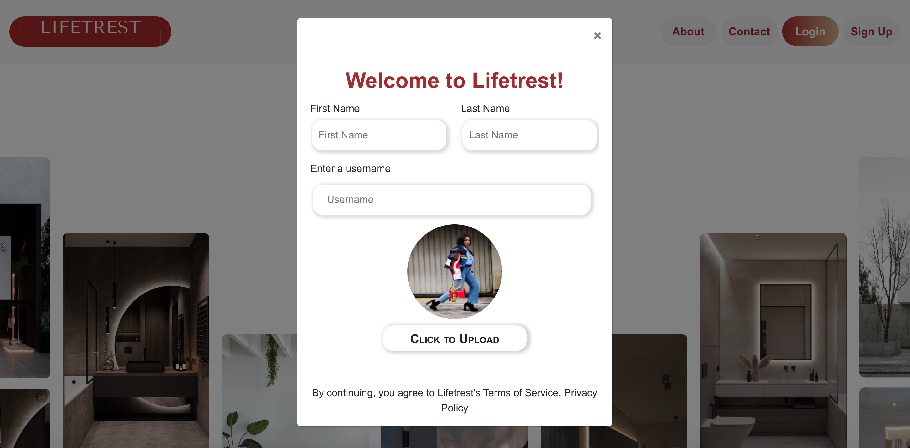
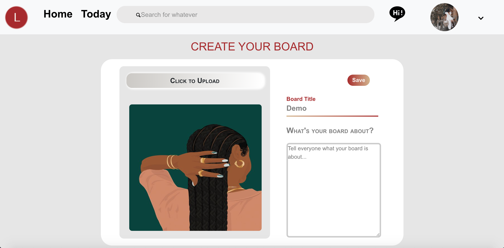
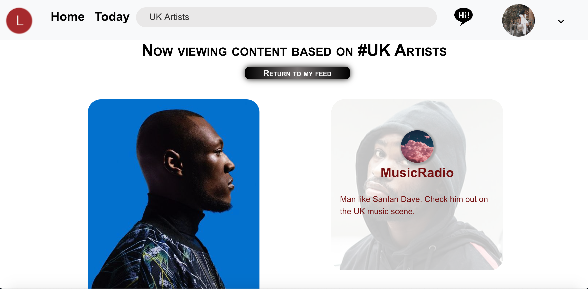
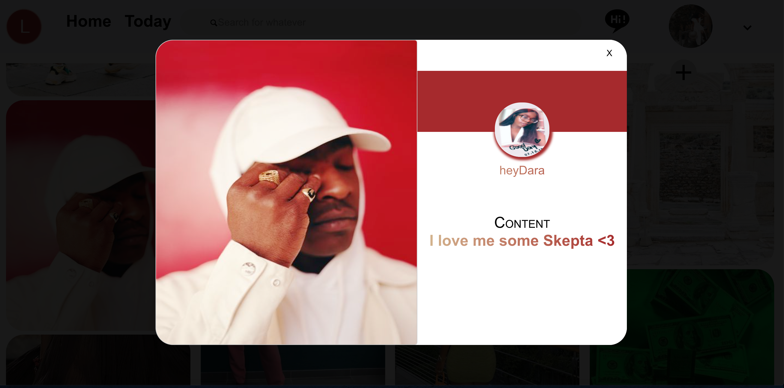

# Lifetrest - [Comprehensive Technical Assessment: Pinterest Clone] 
## Live Site: https://lifetrest.netlify.app/ 
### Lifetrest is a Full-Stack Web Applicatioon where users can to document their life and interests through photos, just like Pinterest.
Best viewed on Web, not completely responsive.
Built with React.js, Node.js with Express, and PostgreSQL.

### Lifetrest: User Signup

### Lifetrest: User feed

### Lifetrest: Create Board 

### Lifetrest: Search Results 

### Lifetrest: View a Pin

## Features
- Create an account or utilize the demo login
- Create pins and boards with photo uploading capabilities
- View pins and visit a user's profile by clicking on the username or their profile picture.
- Users are able to view their own pins and boards. Boards can be deleted which removes all the pins in that particular board
- Search for pins based on hashtags
- Users are able to view anothe user's profile which displays thier pins
- Logout of Lifetrest when they're done via the dropdown 

## Future Implementations
- Users will be able to "like" a pin which will then add then add it to a generated "Likes" board
- The ability to view another user's boards via their profile

# Technical Milestones
- Using Multer for image uploading 
- Allowing users to search for pins based on hashtags
- User authentication with Firebase

# Technologies Used
- Multer for image uploading 
- Firebase for user authentication 
- React [frontend]
- Node.js + Express.js. [backend] 
- PostgreSQL [database]

## Frontend Deployment: Netlify
## Backend Deployment: Heroku
